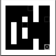

# Maze DQN reinforce learning

미로를 통과하는 DQN 방식의 강화학습 레포입니다.


playing atari with deep reinforcement learning 논문에 나오는 내용을 바탕으로 제작되어



다음과 같이 게임 화면을 변환하여  state로 사용합니다.


main.py 

```python
if(__name__ == "__main__"):
    # train = train_sys()
    # _ = input("press any key to start")
    # train.run()
    test = test_sys()
    test.run()
```

이부분 처럼 주석처리를 하면 작동하는 모습을 볼 수 있으며,

만약 학습시키고 싶다면 

```python
test = test_sys()
test.run()
```

부분을 주석처리하고 윗부분을 사용하시면 됩니다.


다만 학습시 학습하고 있는 화면을 스크린샷을 찍기 때문에, 창이 가려지지 않도록 해주셔야 합니다.